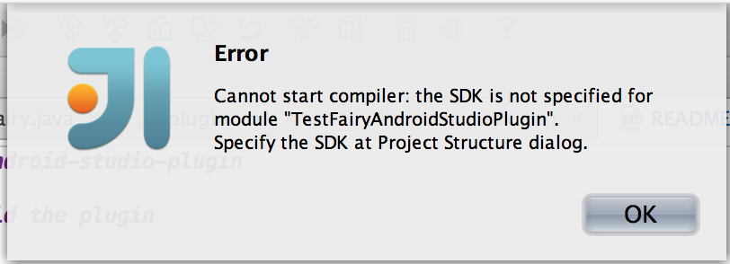
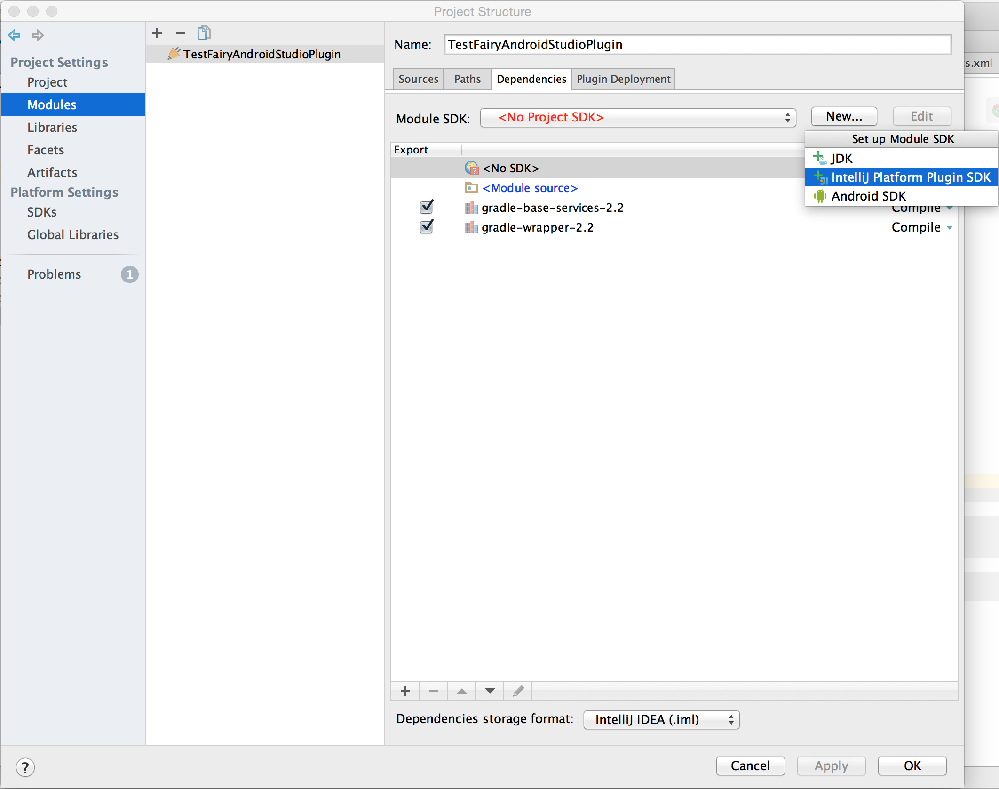

# testfairy-android-studio-plugin

## How to build the plugin

1. Clone this repo
    <pre>git clone git@github.com:testfairy/testfairy-android-studio-plugin.git</pre>

1. From IDEA use File/Open and select the cloned directory.
1. In the main menu go to Build/Prepare Plugin Module 'TestFairyAndroidStudioPlugin' For Deployment.
If you are all set, that will be all. Most likely, first time you'll have to complete the rest of the steps.
1. IDEA will normally complain about missing SDK and proceed to Project Structure/SDK dialog.

1. Select New/IntelliJ Platform Plugin SDK.

1. In file browser, navigate to Android Studio installation (e.g. /Applications/Android Studio.app), and confirm.
1. You'll be prompted for Java SDK version. This will be used to build your plugin.

1. Finally, the wizard will offer to set the SDK just confugured for the project, which you should accept.
1. You can always make the changes to SDK used later (for example use IDEA instead of Android Studio)
by going to File/Project Settings/SDKs

Resources:
- [Writing Plug-ins](http://www.jetbrains.org/display/IJOS/Writing+Plug-ins)
- [Getting Started with Plugin Development](https://confluence.jetbrains.com/display/IDEADEV/Getting+Started+with+Plugin+Development)

